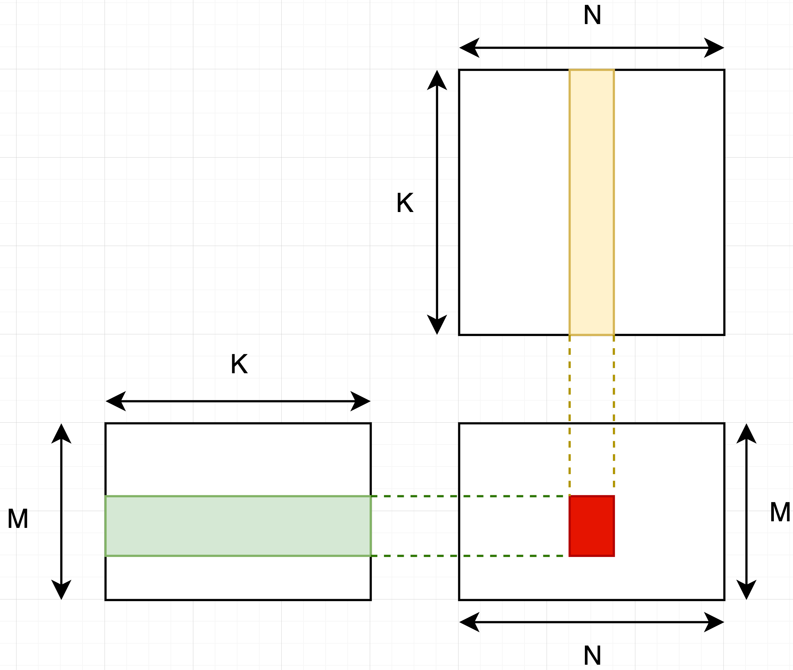

# gemm with mma

## 问题描述

```cpp
A: [M, K] -> row major
B: [K, N] -> col major
C = A @ B = [M, N] -> row major
```


1. **block问题拆分**

读取一个block的数据，如图:



如图，一个block内计算一个红色[BM, BN]大小的矩阵输出，即从A矩阵读取[BM, K], 从B矩阵读取[K, BN]，然后在block内做一个小矩阵乘法即可。对应代码:

```cpp
    constexpr int BM = 32;
    constexpr int BN = 32;
    constexpr int BK = 32;
    constexpr int WMMA_M = 16;
    constexpr int WMMA_N = 16;
    constexpr int WMMA_K = 16;
    constexpr int thread_num = 64;

    dim3 GridDim(DIV_UP(N, BN), DIV_UP(M, BM)); 
    dim3 BlockDim(thread_num, 1);
 
    float* c_ptr = reinterpret_cast<float*>(c.data_ptr());

    gemm_kernel_v4<BM, BN, BK, WMMA_M, WMMA_N, WMMA_K, thread_num>
        <<<GridDim, BlockDim, 0, stream>>>(
               reinterpret_cast<__half*>(a.data_ptr<at::Half>()),
               reinterpret_cast<__half*>(b.data_ptr<at::Half>()),
               nullptr,
               c_ptr,
               M, N, K);
```

这里BK表示按照BK的步长在kernel里进行迭代计算，比如K = 1024, BK = 32。则需要在K方向迭代K / BK轮。WMMA_M/WMMA_N/WMMA_K表示一个mma操作的参数。这里默认输入A和权重B都是half数据类型。

那么每个block内部线程含义呢？代码:

```cpp
  const int blockId = blockIdx.y * gridDim.x + blockIdx.x;

  /***
   *   ------> bx
   *   |
   *   |
   *   V
   *   by
   * ***/
  const int bx = blockIdx.x;
  const int by = blockIdx.y;

  int tid = threadIdx.x;
  int wid = tid / 32;
  int lane_id = tid % 32;
```

bx表示读取N方向(B矩阵），by表示读取M方向(A矩阵)。tid表示线程，wid表示tid对应的是第一个warp，lane_id表示当前warp内是第几个线程(0到31)。

1. **加载A/B矩阵计算数据到shared memory中**

由于还是按照K维度拆分，所以每个k迭代读取的A数据是[BM, BK]大小, 所以需要做的是怎么通过64个线程将BM * BK = 32 * 32个元素从global memory加载到shared memory中呢？第一步则是先申请一个shared memory，由于需要存储A和B，则对应大小:

```cpp
  constexpr int smem_num = ((BM + BN) * BK) > (2 * BM * BN) ? ((BM + BN) * BK) : (2 * BM * LDN);

  constexpr int max_smem_block = 49152; // max bytes in RTX4090
  static_assert(max_smem_block >= smem_num && "smem_num must be small 49152");

  __shared__ half smem[smem_num];
  half* s_a = smem;  // [BM, BK]的大小
  half* s_b = smem + BM * BK;  // [BK, BN]的大小
```

**global memory内存地址获取**


如图，第一步是获取一个小[BM, BK]块的首地址指针，这里就是

```cpp
  // 第(bx, by）个block内，对应A矩阵[BM, K]的首地址指针。
  int load_block_a_gmem_addr = by * BM * K;

  // 第bk次计算[BM, BK]首地址:
  load_block_a_gmem_addr += bk * BK

  // 第(bx, by）个block内，对应B矩阵[K, BN]的首地址指针。注意这里B是col major的。
  int load_block_b_gmem_addr = bx * BN * K;
```

bk表示K方向第几次循环, 一次计算得到一个[BM, BN]矩阵，然后K方向迭代bk次得到bk个[BM, BN]，将这bk个矩阵相加就得到了最终[BM, K] @ [K, BN]的输出了。

上面得到了每个[BM, BK]的global memory地址，也申请了对应的shared memory大小，然后就是一对一加载就可以了，只需要抽象得到每个线程需要加载的行和列即可。问题拆分如下：


因为在cuda里所有的线程执行的操作都是一样的，所以就将问题变成了怎么将1024个元素拆解，每个线程处理1024 / 64 = 16个元素，那么一个线程内16个元素，可以写一个for循环16次，为了加速数据读取可以使用float4读取来加速，由于一个float4可以一个指令加载4个float元素，又因为这里输入A/B是half的数据类型，所以用一个float4指令可以加载8个half元素。所以一个线程只需要执行两次float4循环加载就可以完成对应的数据操作了。这里图中的几个含义解析：

```cpp
 // 对应一个线程一次处理的数据大小，即上面说的一个float4对应8个half元素。  
 constexpr int BK_load_step = 8;
 
 // 读取一行元素需要几个线程。
 constexpr int BK_step = BK / BK_load_step;  // 32 / 8 = 4

 constexpr int BM_load_step = BM / (THREADNUM / BK_step); // 32 / (64 / 4) = 2

 // 一个线程需要进行几次循环读取，这里一个线程要2次loop才能读取16个元素
 constexpr int load_a_smen_cycle = BM * BK / THREADNUM / 8 >= 1 ? BM * BK / THREADNUM / 8 : 1;   // 32 * 32 / 64 / 8 = 2, one thread load load_a_smem_cycle * 8 number.
 static_assert(load_a_smen_cycle >= 1 && "load_a_smen_cycle must be non-negative");

 // 每个线程加载的时候在[BM, BK]矩阵范围内对应的行， 通过tid来获取行列，64个线程分别处理不同元素
 int load_a_smem_m = (tid / BK_step) * BM_load_step;  // row for tid load a.
 // 每个线程加载对应的列
 int load_a_smem_k = (tid % BK_step) * BK_load_step;  // col for tid load a
```

在得到行和列之后就可以进行数据搬运了

```cpp
  // 指针数组用来存储一个tid上搬运的数据的指针地址
  half* load_a_smem_addrs[load_a_smen_cycle];  // 8 one tid process load_a_smem_cycle data
  for (int i = 0; i < load_a_smen_cycle; ++i) {
    load_a_smem_addrs[i] = s_a + load_a_smem_m * BK + load_a_smem_k + i * BK;
  }

  half* load_b_smem_addrs[load_b_smem_cycle];
#pragma unroll
  for (int i = 0; i < load_b_smem_cycle; i++) {
    load_b_smem_addrs[i] = s_b + load_b_smem_n * BK + load_b_smem_k + i * BK;
  }

  // 根据行和列获取global memory对应的地址指针
  int load_block_a_gmem_addr = by * BM * K;  // start a matrix ptr in block (bx, by)
  int load_block_b_gmem_addr = bx * BN * K;
  int load_thread_a_gmem_addr = load_block_a_gmem_addr + load_a_smem_m * K + load_a_smem_k;
  int load_thread_b_gmem_addr = load_block_b_gmem_addr + load_b_smem_n * K + load_b_smem_k;

  // main for loop for K
  for (int bk = 0; bk < K / BK; bk++) {
    // load gmem to smem
    for (int i = 0; i < load_a_smen_cycle; i++) {
     *(float4*)(load_a_smem_addrs[i]) = *(float4*)(&a[load_thread_a_gmem_addr + i * K]);
    }

#pragma unroll
    for (int i = 0; i < load_b_smem_cycle; i++) {
        *(float4*)(load_b_smem_addrs[i]) = *(float4*)(&b[load_thread_b_gmem_addr + i * K]);
    }
   
   // do mma next

    __syncthreads(); // 等待所有线程执行完，则一次[BM, BK]和[BK, BN]数据到shared memory完成

    load_thread_a_gmem_addr += BK;  // 下一个迭代，更新gloabl memory地址指针
    load_thread_b_gmem_addr += BK;

 }
```

1. **wmma计算**

当数据存储在shared memory上之后就可以进行具体的矩阵乘法计算了，这里为了利用上tensor core,调用wmma tensor core指令。一些基础的概念, mma计算的时候需要将输入输出存放在fragment中， WMMA_M/WMMA_N/WMMA_K=16则是基础的矩阵计算的三个参数， row_major和col_major则表示对应矩阵的数据存储layout。

```cpp
  nvcuda::wmma::fragment<nvcuda::wmma::matrix_a, WMMA_M, WMMA_N, WMMA_K, half, nvcuda::wmma::row_major> frag_a[num_frag_a];
  nvcuda::wmma::fragment<nvcuda::wmma::matrix_b, WMMA_M, WMMA_N, WMMA_K, half, nvcuda::wmma::col_major> frag_b[num_frag_b];
  nvcuda::wmma::fragment<nvcuda::wmma::accumulator, WMMA_M, WMMA_N, WMMA_K, float> frag_c[num_frag_a][num_frag_b];
```

即调用一个mma的计算可以得到一个输出16x16大小的矩阵输出。那这里又涉及到了一个数据的搬运操作，即将对应数据从shared memory放到fragement中，nvcuda::wmma::fragement对象在不同的warp上是使用了不同的物理寄存器的，每个warp会创建自己的fragement存储单元。

注：fragment的作用域是在warp内，所以申请的是一个warp的大小。比如wmma::fragment<…> frag[2]; 含义是在第一个warp申请两个frag, 在第二个warp也会申请两个frag。

计算


假设K方向被拆成K/WMMA_K=k个小矩阵，则得到一个输出矩阵c[0,0]:

$$
c[0, 0]=a[0, 0]*b[0, 0]+a[0,1]*b[1,0]+...+a[0,k-1]*b[k-1,0]
$$

所以得到一个输出矩阵需要k个mma操作以及需要将得到的k个结果加在一起。

这里可以看出k个mma之间是可以同时进行计算的（如果资源够的话），比如一个SM有4个tensor core单员，那么同一个cycle内可以执行4个mma。所以需要对a和b矩阵进行warp的拆分，即同一个时刻可以通过warp来实现并行。

第一步还是数据搬运问题抽象分析，对a矩阵：


如图，假设warp_num表示有几个warp, 比如一个block 64个线程就是2个warp， 一个warp计算一个mma，一个mma大小是WMMA_M, WMMA_K, WMMA_N，则对于[BM, BK]来说，需要拆分成[BM / WMMA_M, BK / WMMA_K] = [num_frag_a, k]个小的mma计算单元。如上面分析，通过warp并行来计算mma: 一个warp完成计算BM方向所有num_frag_a个mma，在BK方向用warp个mma同时并行计算。但是可能存在BK太大，warp个数小于k，那么在BK方向一个warp可能还需要计算多次，这里用mma_cycle来表示。假设BK=64, WMMA_K=16，则K方向就需要拆解成4个mma, 一个block有64个线程的话2个warp，则mma_cycle=2, 则:


红色是第一个warp需要计算的，黄色是第二个warp需要计算的。

计算代码:

```cpp
    // warp tile
  constexpr int warp_size = 32;  // 一个warp32个线程
  constexpr int num_frag_a = BM / WMMA_M;  // 32 / 16 = 2
  constexpr int num_frag_b = BN / WMMA_N;  // 32 / 16 = 2
  
  constexpr int warp_num = THREADNUM / warp_size;  // 计算有几个warp, 64 / 32 = 2
  
  // 比如只有64线程2个warp，那么同时只能计算两个mma，这里表示所有warp计算的步长。
  constexpr int mma_offset = warp_num * WMMA_K;  // 2 * 16 = 32
  
  // mma cycle表示在BK方向上同一个warp需要进行几次循环。
  constexpr int mma_cycle = BK / mma_offset >= 1 ? BK / mma_offset : 1;
  static_assert(mma_cycle >= 0 && "mma_cycle must be non-negative");
```

然后就可以进行数据加载：从shared memory加载一个mma的A/B矩阵元素到fragement上，可以通过nvcuda::wmma::load_matrix_sync来实现这个异步加载，这个指令怎么使用怎么含义呢？看mma.h定义:

```cpp
  __CUDA_MMA_DEVICE_DECL__ void load_matrix_sync(fragment<matrix_a, 16, 16, 16, __half, row_major>& a, const __half* p, unsigned ldm) __DEF_IF_HOST

```

实际只需要指定shared memory的首地址指针和ldm(the leading dimension of the matrix in memory)即可了。

```cpp
 for (int bk = 0; bk < K / BK; bk++) {
    for (int i = 0; i < mma_cycle; i++) {
      for (int m_index = 0; m_index < num_frag_a; m_index++) {
        // 这里ldm是shared memroy A矩阵的(row major)的行BK，告诉fragement下一行需要间隔是BK
        nvcuda::wmma::load_matrix_sync(frag_a[m_index],
          &s_a[load_a_smem_offset * m_index + wid * WMMA_K + i * mma_offset], BK);

        for (int n_index = 0; n_index < num_frag_b; n_index++) {
          nvcuda::wmma::load_matrix_sync(frag_b[n_index],
            &s_b[load_b_smem_offset * n_index + wid * WMMA_K + i * mma_offset], BK);
       
          // mma.sync.aligned.m16n8k16.row.col.f32.f16.f16.f32
          nvcuda::wmma::mma_sync(frag_c[m_index][n_index], frag_a[m_index], frag_b[n_index],
                                 frag_c[m_index][n_index]);
      }
    }
  }
```

一个warp就完成了frag_c[m_index][n_index]的部分计算。

1. 多个mma输出数据累加

对于32*32的输出来说，m_index==n_index==2，线程64即有两个warp。那么经过前面的mma计算，实际上是得到2个frag_c[2][2]的输出大小（每个warp是独立的）。那么就需要将所有warp的frag_c全部相加才能得到最后需要的输出，即前面分析的第一行红色部分warp和黄色warp相加之后才是最总的c[0][0]的结果。为了比较好理解需要先清楚一下frag_c的数据存储格式是什么样的，frage_c是一个16x16大小的矩阵，但是并不是顺序数据排列的。根据MMA .m16n8k16 fragment layout（from ptxhttps://docs.nvidia.com/cuda/pdf/ptx_isa_8.5.pdf）


对于一个fragement来说16*16=256个元素并不是存储在同一个线程上的，是有一个warp(32个线程)共同存储的。即一个线程存储了256/32=8个元素。这8个元素对应在16*16矩阵的行和列计算公式如上图(不同mma和硬件不一样，这里是rtx4090）

计算公式

```cpp
      for (int i = 0; i < frag_c[0][0].num_elements; i++) {
        **int row{0}, col{0};
        int groupID = lane_id >> 2;
        int threadID_in_group = lane_id % 4;
        if (i < 4) {
          row = i < 2 ? groupID : groupID + 8;
          col = (threadID_in_group * 2) + (i & 0x1);
        } else {
          int j = i - 4;
          row = j < 2 ? groupID : groupID + 8;
          col = (threadID_in_group * 2) + (j & 0x1) + 8; 
        }**
        printf("(%2d,%2d) ", row, col);

        float vf = frag_c[0][0].x[i];
        // printf("%f ", vf);
        c[row * BN + col] = vf;
      }
```

```bash
# 一个fragement c的matrix排布
( 0, 0) ( 0, 1) ( 8, 0) ( 8, 1) ( 0, 8) ( 0, 9) ( 8, 8) ( 8, 9) 
( 0, 2) ( 0, 3) ( 8, 2) ( 8, 3) ( 0,10) ( 0,11) ( 8,10) ( 8,11) 
( 0, 4) ( 0, 5) ( 8, 4) ( 8, 5) ( 0,12) ( 0,13) ( 8,12) ( 8,13) 
( 0, 6) ( 0, 7) ( 8, 6) ( 8, 7) ( 0,14) ( 0,15) ( 8,14) ( 8,15) 
( 1, 0) ( 1, 1) ( 9, 0) ( 9, 1) ( 1, 8) ( 1, 9) ( 9, 8) ( 9, 9) 
( 1, 2) ( 1, 3) ( 9, 2) ( 9, 3) ( 1,10) ( 1,11) ( 9,10) ( 9,11) 
( 1, 4) ( 1, 5) ( 9, 4) ( 9, 5) ( 1,12) ( 1,13) ( 9,12) ( 9,13) 
( 1, 6) ( 1, 7) ( 9, 6) ( 9, 7) ( 1,14) ( 1,15) ( 9,14) ( 9,15) 
( 2, 0) ( 2, 1) (10, 0) (10, 1) ( 2, 8) ( 2, 9) (10, 8) (10, 9) 
( 2, 2) ( 2, 3) (10, 2) (10, 3) ( 2,10) ( 2,11) (10,10) (10,11) 
( 2, 4) ( 2, 5) (10, 4) (10, 5) ( 2,12) ( 2,13) (10,12) (10,13) 
( 2, 6) ( 2, 7) (10, 6) (10, 7) ( 2,14) ( 2,15) (10,14) (10,15) 
( 3, 0) ( 3, 1) (11, 0) (11, 1) ( 3, 8) ( 3, 9) (11, 8) (11, 9) 
( 3, 2) ( 3, 3) (11, 2) (11, 3) ( 3,10) ( 3,11) (11,10) (11,11) 
( 3, 4) ( 3, 5) (11, 4) (11, 5) ( 3,12) ( 3,13) (11,12) (11,13) 
( 3, 6) ( 3, 7) (11, 6) (11, 7) ( 3,14) ( 3,15) (11,14) (11,15) 
( 4, 0) ( 4, 1) (12, 0) (12, 1) ( 4, 8) ( 4, 9) (12, 8) (12, 9) 
( 4, 2) ( 4, 3) (12, 2) (12, 3) ( 4,10) ( 4,11) (12,10) (12,11) 
( 4, 4) ( 4, 5) (12, 4) (12, 5) ( 4,12) ( 4,13) (12,12) (12,13) 
( 4, 6) ( 4, 7) (12, 6) (12, 7) ( 4,14) ( 4,15) (12,14) (12,15) 
( 5, 0) ( 5, 1) (13, 0) (13, 1) ( 5, 8) ( 5, 9) (13, 8) (13, 9) 
( 5, 2) ( 5, 3) (13, 2) (13, 3) ( 5,10) ( 5,11) (13,10) (13,11) 
( 5, 4) ( 5, 5) (13, 4) (13, 5) ( 5,12) ( 5,13) (13,12) (13,13) 
( 5, 6) ( 5, 7) (13, 6) (13, 7) ( 5,14) ( 5,15) (13,14) (13,15) 
( 6, 0) ( 6, 1) (14, 0) (14, 1) ( 6, 8) ( 6, 9) (14, 8) (14, 9) 
( 6, 2) ( 6, 3) (14, 2) (14, 3) ( 6,10) ( 6,11) (14,10) (14,11) 
( 6, 4) ( 6, 5) (14, 4) (14, 5) ( 6,12) ( 6,13) (14,12) (14,13) 
( 6, 6) ( 6, 7) (14, 6) (14, 7) ( 6,14) ( 6,15) (14,14) (14,15) 
( 7, 0) ( 7, 1) (15, 0) (15, 1) ( 7, 8) ( 7, 9) (15, 8) (15, 9) 
( 7, 2) ( 7, 3) (15, 2) (15, 3) ( 7,10) ( 7,11) (15,10) (15,11) 
( 7, 4) ( 7, 5) (15, 4) (15, 5) ( 7,12) ( 7,13) (15,12) (15,13) 
( 7, 6) ( 7, 7) (15, 6) (15, 7) ( 7,14) ( 7,15) (15,14) (15,15)
```

写回数据到global memory

```python
  // shared to global memory
  int gmem_store_ptr = by * BM * N + bx * BN;
  int store_cycle = BM * BN / THREADNUM;  // 一个线程写回几个数
  int smem_row = tid * store_cycle / BN;  // 对应smem的行
  int smem_col = tid * store_cycle % BN;  // 对应smem的列
  for (int id = 0; id < store_cycle; ++id) {
    c[gmem_store_ptr + smem_row * N + smem_col + id] = smem_float[smem_row * BN + smem_col + id];
  }
```

由此，第一个gemm版本算是有一个出版本了，测试下精度ok，性能M=N=K=4096:

```python
Torch Throughput:  159980.5549770431  GFLOPS
Flash Throughput:  35715.593380344  GFLOPS
```

4090-fp16理论算力是165 TFLOPS，第一个版本只有torch(底层是cublas)的22%。

# multi stage

主要参考: https://github.com/KnowingNothing/MatmulTutorial/tree/main, 重新实现了下便于理解里面的逻辑